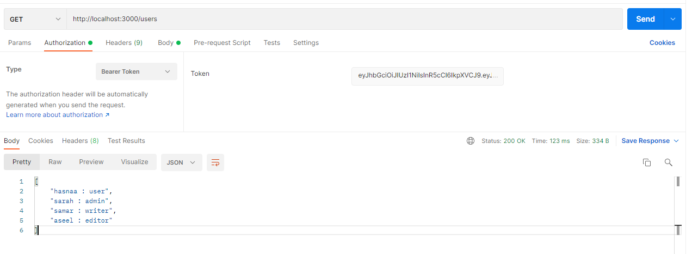
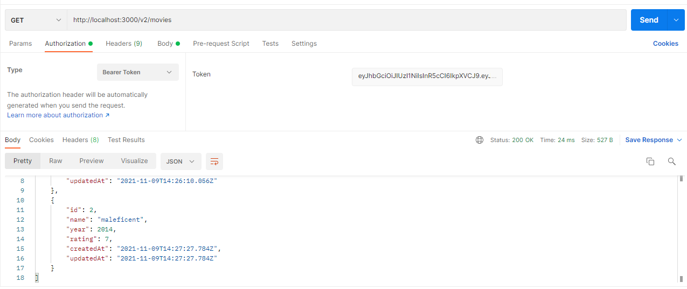
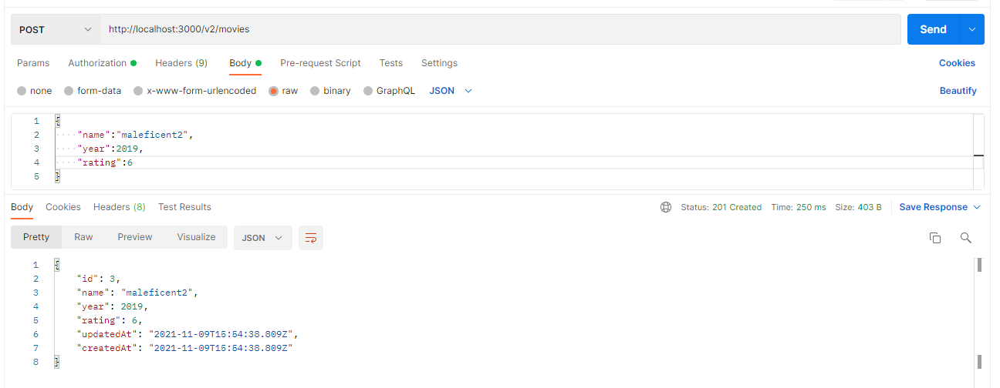
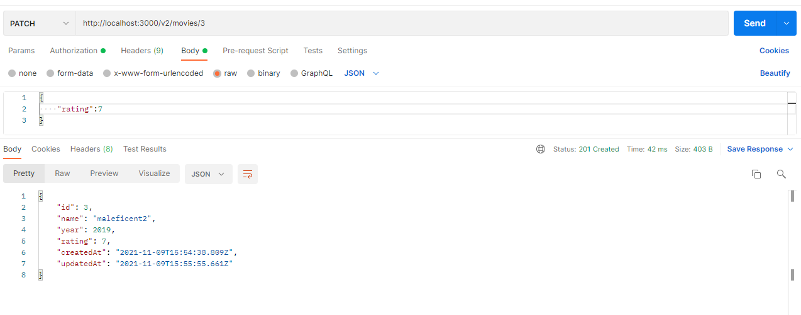
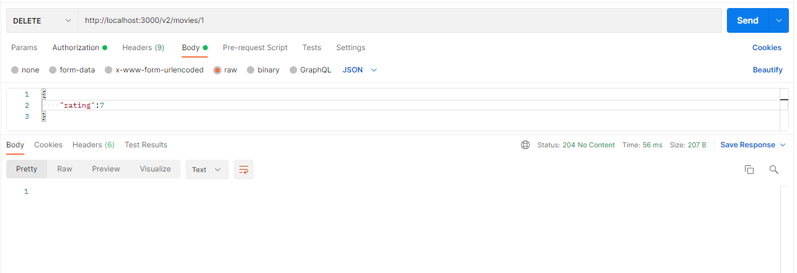
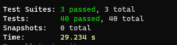
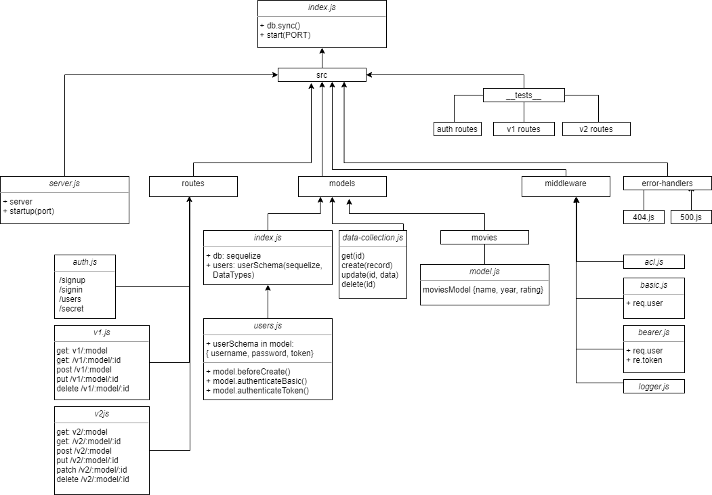

# auth-api

## Description

This is a fully functional, authenticated and authorized API Server.

## Links

* Heroku:
* PR: 

## Endpoints

* post `/signup`
* post `/signin`
* get `/users`

* get `/secret`
* get `/v1/:model/:id`
* get `/v1/:model/:id`
* post `/v1/:model`
* put `/v1/:model/:id`
* delete `/v1/:model/:id`
* get `/v2/:model/`

* get `/v2/:model/:id`
* post `/v2/:model`

* put `/v2/:model/:id`
* patch `/v2/:model/:id`

* delete `/v2/:model/:id`

## Tests

### Auth Routes Testing

- happy sign-up scenario for all roles - can add records to the DB
- happy basic auth sign-in scenario for all roles
- happy bearer auth scenario using the correct token
- basic auth sign-in with correct username but incorrect password
- basic auth sign-in with unsigned user (doesn't have a record)
- bearer auth with incorrect token

### v1 Routes Testing

- Can add an item to the DB and returns an object with the added item
- Can return a list of all :model items
- Can return a single item by ID
- Can return a single updated item by ID
- Can delete a record and returns an empty object after

### v2 Routes Testing

- Can create a record in the DB with admin, writer, and editor permissions
- Can update a record in the DB with admin and editor permissions (put, patch)
- Can delete a record in the DB with admin and editor permissions only
- Can get all records from the DB without any permissions
- Can get a single record from the DB without any permissions

### All tests passed

## UML

